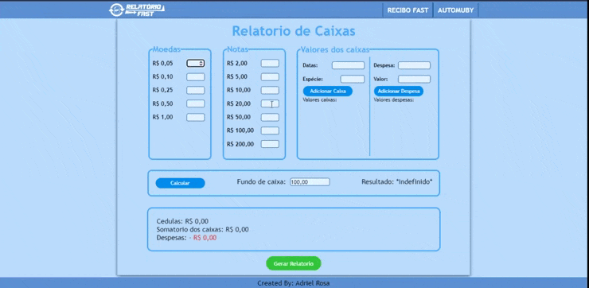

# Plataforma para relatorio

> Adriel Rosa (update: 17/11/2022 - 10:41 AM)

Uma pagina em HTML e Javascript destinada a gerencias fundos de caixas e criar relatórios simples de caixas de lojas .

[Clique aqui para acessar a página](https://adrielrosa2001.github.io/relatorios-caixas-webpage/)

## Tecnologias

- HTML
- CSS
- JavaScript
- Git e GitHub

## Contatos

- E-mail: adrielrosa@live.com
- LinkedIn: https://www.linkedin.com/in/jonathan-ramos-p/
